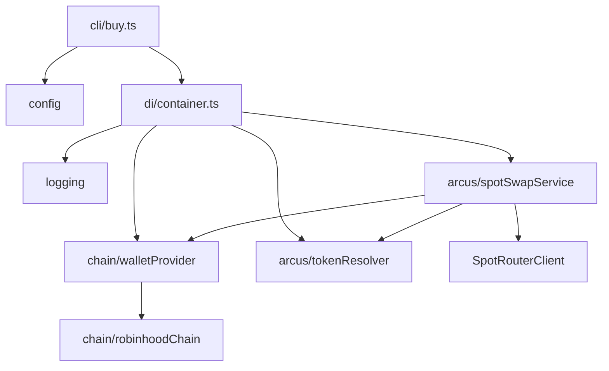
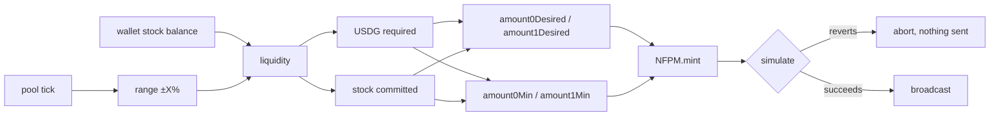
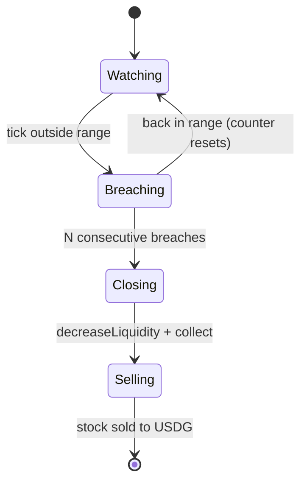
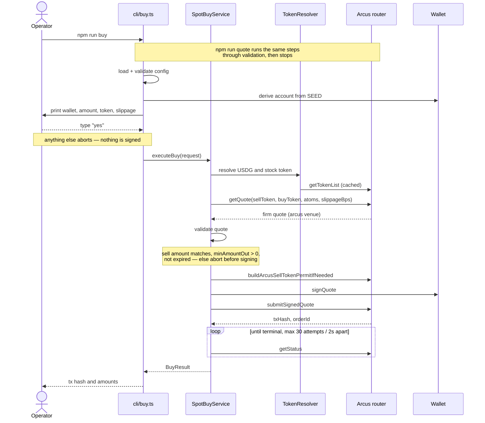

# Architecture

`arcusamm` is an automated market-making bot for tokenized stocks on Robinhood Chain. The full strategy buys a stock token on Arcus spot, deposits it into a Uniswap v3 USDG/stock pool with a concentrated range, and closes when the pool shifts fully to one side.

All four steps are implemented: a manually triggered Arcus spot buy ([plan 0001](../plans/0001-arcus-spot-buy-cli.md)), a v3 position with a ±X% range ([plan 0002](../plans/0002-uniswap-v4-lp-deposit.md), superseded by [plan 0005](../plans/0005-migrate-to-uniswap-v3.md)), pool monitoring and exit ([plan 0003](../plans/0003-position-monitor.md)), and profit/loss reporting ([plan 0004](../plans/0004-pnl-reporting.md)).

The Arcus buy delivers the **plain** stock token — the same one the pool uses — confirmed from the `SwapExecuted` logs of a live trade. No wrap/unwrap step is needed.

**Migrated from v4 to v3** (plan 0005). v3 has no singleton PoolManager: each pool is its own contract, resolved live via `factory.getPool()` rather than a hash computed offline. Positions are enumerable (`balanceOf` + `tokenOfOwnerByIndex`), so discovery needs no block-range lookback — the exact bug class that once caused `monitor`/`exit` to miss a real position. Approvals are a single plain `approve()`, since v3 pulls funds via `transferFrom` rather than routing through Permit2.

## Modules

| Module | Purpose |
| --- | --- |
| `config/` | Zod schema over `process.env`; fails fast on an invalid environment. `loggableConfig` strips the seed for logging. |
| `logging/` | pino factory with secret redaction; child loggers bind a `tradeId` so one trade is traceable end to end. |
| `chain/` | viem `Chain` for Robinhood Chain (4663) and the `WalletProvider` that derives the production account from `SEED`. |
| `arcus/` | Token resolution from the router list, typed errors, and `SpotBuyService` — the quote → sign → submit → poll flow. |
| `uniswap/` | v3 deployment addresses, pool address resolution (`poolAddress.ts`), tick and liquidity math, pool reads, range calculation, plain ERC20 approvals (`erc20.ts`), mint/close/discovery/fees, and the deposit and exit orchestration. |
| `pnl/` | Profit and loss: pure arithmetic in `pnlCalculator.ts`, chain reconstruction in `pnlReporter.ts`. |
| `di/` | The single composition root. Everything else takes dependencies as constructor parameters. |
| `cli/` | `buyCommand.ts` and `depositCommand.ts` hold the command logic (IO-free, so the confirmation gates are testable); `buy.ts`, `quote.ts`, `deposit.ts`, and `position.ts` are thin entrypoints. |



## Commands

| Command | Effect |
| --- | --- |
| `npm run quote` | Read-only. Resolves tokens, quotes, and validates, then stops. |
| `npm run position` | Read-only. Reads the pool and balances, computes the range and both legs, then stops. |
| `npm run buy` | Buys, then deposits. Two separate confirmations. `--no-deposit` stops after the buy. |
| `npm run deposit` | Opens a position from the balance already held. |
| `npm run monitor` | Long-running. Closes positions that go one-sided and sells the stock token. `--dry-run` sends nothing. |
| `npm run exit` | Withdraws liquidity, claims fees, and sells the stock token. Confirmed; `--dry-run` sends nothing. |
| `npm run pnl` | Read-only. Profit and loss reconstructed from chain logs, including uncollected fees. |

Each preview shares its code path with the command that spends — `quote` with `SpotBuyService.prepare`, `position` with `DepositService.plan` — so a preflight cannot drift from what actually executes.

## Liquidity position



The stock balance is the fixed side: it determines the liquidity, which in turn determines the USDG required. If the wallet is short of that USDG the deposit aborts before anything is approved. `amount0Desired`/`amount1Desired` bound what the mint may pull (computed amount plus `LP_SLIPPAGE_BPS`), `amount0Min`/`amount1Min` bound what it must return (computed amount minus the same margin) — v3's `mint()` takes both, unlike v4's single ceiling.

Range bounds are aligned **outward** to the tick spacing, so the realized band is never narrower than requested. Because price is exponential in tick, each side is computed independently — at 3%, the lower bound is ~305 ticks away while the upper is ~296.

## Exit

`token0` is USDG and `token1` is the stock token, so by Uniswap's convention:

| Pool tick | Position holds | Meaning |
| --- | --- | --- |
| `<= tickLower` | only USDG | the pool moved fully to USDG |
| `>= tickUpper` | only the stock token | the pool moved fully to stock |

Either way the position has stopped earning a two-sided spread and is closed. `npm run exit` runs the identical path on demand: both the monitor and the manual command delegate to `PositionExitService`, so a hand-run exit cannot diverge from the automatic one. `decreaseLiquidity` removes the position's liquidity into `tokensOwed`, then `collect` sweeps everything owed — principal and accrued fees together — back to the wallet, bundled into one `multicall` transaction. Any stock token is then sold to USDG on Arcus — so the resting state is all USDG.



The breach counter is what stops a momentary wick from realizing a loss; it resets the instant the pool reads back in range.

Discovery enumerates the wallet's position NFTs directly (`balanceOf` + `tokenOfOwnerByIndex`, then `positions(tokenId)`) and filters by `(token0, token1, fee)`. No block-range scan, and no lookback window to get wrong — the wallet holds position NFTs from unrelated pools, and the filter is what keeps them out of reach of the closer.

## Profit and loss

```
net = sells + open value + uncollected fees − (purchases + USDG deposited)
```

Two properties make this trustworthy:

- **No local ledger.** Everything is reconstructed from chain logs, so the report cannot drift when the wallet is used outside the bot — which has happened.
- **Deposits count as capital.** A position is funded partly by the stock bought on Arcus and partly by USDG taken straight from the wallet. Only the first passes through a trade. Counting the position's full value as a gain while counting only the Arcus spend as capital invents profit equal to the USDG side of the deposit. The deposited amount is read from the position's mint `IncreaseLiquidity` event — the earliest one ever emitted for that tokenId, found by scanning the position manager's logs filtered on the tokenId's indexed topic — and a test pins the failure mode.

Uncollected fees come from `liquidity × Δ feeGrowthInside / 2^128`. Unlike v4, v3 has no single-call lens for `feeGrowthInside`: it is computed from the pool's global fee-growth accumulators and the outside growth recorded at each tick boundary, using the formula transcribed from Uniswap's own `Tick.sol`.

Limitation: the RPC serves historical *state* only ~1000 blocks back, so fees cannot be split from principal for positions that closed long ago. Realized PnL is unaffected, since it comes from logs.

## Buy flow



## Safety properties

- The operator must type `yes` before anything is signed. `--yes` skips the prompt for future automation but is never the default.
- Quote validation runs **before** signing. A quote that spends a different amount than requested, guarantees no minimum output, or has already expired is rejected with nothing signed.
- Only the read-only status poll retries. Nothing in the quote → sign → submit chain is retried automatically, so a failure never risks funds twice.
- The poll loop is bounded by attempt count, so it always terminates. A timeout reports the tx hash, since the trade may still settle.
- A non-permittable sell token is surfaced as an error describing the required one-time `approve`. The bot does not send that transaction itself, because it spends gas without operator confirmation.
- The seed phrase is never logged: it is excluded from `loggableConfig` and additionally covered by pino redaction paths.

## Error types

All extend `ArcusError` and carry the `tradeId`.

| Error | Meaning | Signed? |
| --- | --- | --- |
| `ArcusQuoteError` | Router returned no Arcus quote | No |
| `QuoteValidationError` | Quote failed a pre-signing safety check | No |
| `ArcusPermitError` | Sell token cannot produce an EIP-2612 permit | No |
| `ArcusSubmissionError` | Router rejected the signed quote | Yes |
| `ArcusExecutionFailedError` | Trade settled as failed on chain | Yes |
| `ArcusPollTimeoutError` | No terminal state within the budget; may still land | Yes |

## Not yet built

Re-entry after an exit: once a position closes, the wallet rests in USDG and the loop ends. Buying and re-depositing at the new price to resume the market-making cycle is the natural next step.
