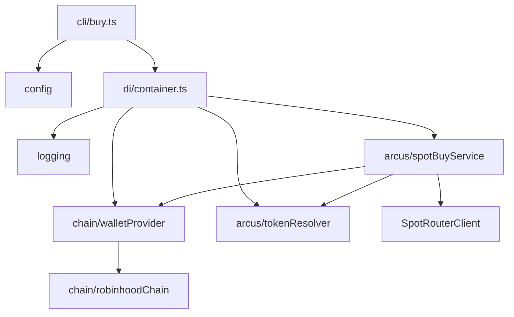
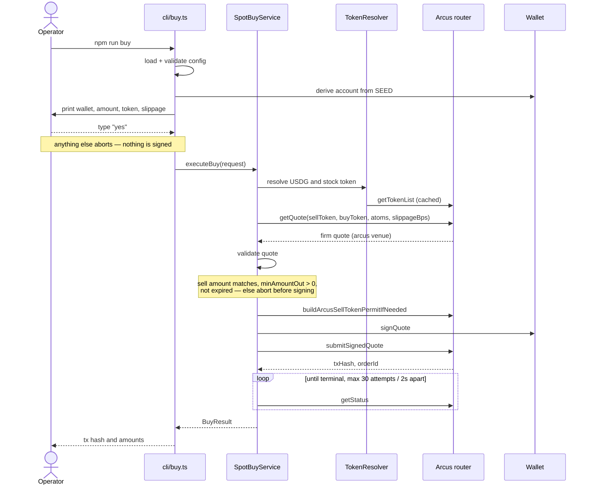

# Architecture

`arcusamm` is an automated market-making bot for tokenized stocks on Robinhood Chain. The full strategy buys a stock token on Arcus spot, deposits it into a Uniswap v4 USDG/stock pool with a concentrated range, and rebalances when the pool shifts fully to one side.

**Currently implemented: step 1 only** — a manually triggered Arcus spot buy. See [plans/0001-arcus-spot-buy-cli.md](../plans/0001-arcus-spot-buy-cli.md).

## Modules

| Module | Purpose |
| --- | --- |
| `config/` | Zod schema over `process.env`; fails fast on an invalid environment. `loggableConfig` strips the seed for logging. |
| `logging/` | pino factory with secret redaction; child loggers bind a `tradeId` so one trade is traceable end to end. |
| `chain/` | viem `Chain` for Robinhood Chain (4663) and the `WalletProvider` that derives the production account from `SEED`. |
| `arcus/` | Token resolution from the router list, typed errors, and `SpotBuyService` — the quote → sign → submit → poll flow. |
| `di/` | The single composition root. Everything else takes dependencies as constructor parameters. |
| `cli/` | `buyCommand.ts` holds the command logic (IO-free, so the confirmation gate is testable); `buy.ts` is the thin entrypoint. |

## Buy flow

## Safety properties

- The operator must type `yes` before anything is signed. `--yes` skips the prompt for future automation but is never the default.
- Quote validation runs **before** signing. A quote that spends a different amount than requested, guarantees no minimum output, or has already expired is rejected with nothing signed.
- Only the read-only status poll retries. Nothing in the quote → sign → submit chain is retried automatically, so a failure never risks funds twice.
- The poll loop is bounded by attempt count, so it always terminates. A timeout reports the tx hash, since the trade may still settle.
- A non-permittable sell token is surfaced as an error describing the required one-time `approve`. The bot does not send that transaction itself, because it spends gas without operator confirmation.
- The seed phrase is never logged: it is excluded from `loggableConfig` and additionally covered by pino redaction paths.

## Error types

All extend `ArcusError` and carry the `tradeId`.

| Error | Meaning | Signed? |
| --- | --- | --- |
| `ArcusQuoteError` | Router returned no Arcus quote | No |
| `QuoteValidationError` | Quote failed a pre-signing safety check | No |
| `ArcusPermitError` | Sell token cannot produce an EIP-2612 permit | No |
| `ArcusSubmissionError` | Router rejected the signed quote | Yes |
| `ArcusExecutionFailedError` | Trade settled as failed on chain | Yes |
| `ArcusPollTimeoutError` | No terminal state within the budget; may still land | Yes |

## Not yet built

Steps 2–4 of the strategy — Uniswap v4 position opening with a ±X% range, pool monitoring, and close/rebalance. Their configuration knobs (deviation percent, v4 fee tier, poll frequency) are intentionally absent until those features exist.
