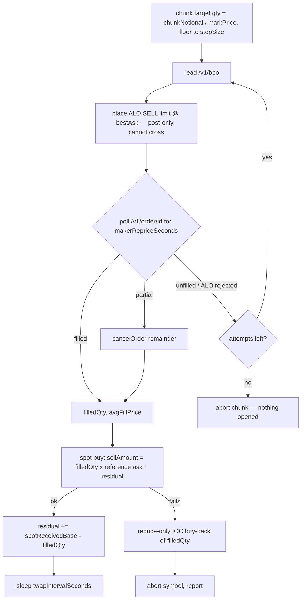

# Plan 0011 — Delta-neutral: Arcus spot long + Arcus perp short

## Context

The bot currently buys a stock token on Arcus spot and market-makes it against USDG in a
Uniswap v3 concentrated-range pool (plans 0001–0010). That strategy earns LP fees and
carries directional risk whenever the pool goes one-sided.

**The new strategy is a cash-and-carry basis trade.** For each symbol, open a spot long on
Arcus Spot and an equal-notional **short perpetual** on Arcus Perps at the same time. The
two legs cancel each other's price exposure; the position earns the **funding rate** the
perp short receives, hour by hour. Symbols are chosen by which ones have historically paid
the most to shorts.

Uniswap is no longer part of the strategy and comes out of the repo.

### Why this works on Arcus specifically

Verified live against the mainnet API on 2026-08-09:

- **A shared universe exists.** 25 symbols are tradable on both sides — the intersection of
  the spot router's token list and the **`ONLINE`** perp markets with `category != CRYPTO`:
  `AMD INTC GOOGL META MU BABA CRCL SLV USO SPY QQQ NVDA TSLA AAPL AMZN MSFT SNDK PLTR
  CRWV ORCL SPCX BE USAR COIN SKHY`.
  `HOOD GLD DRAM` are perp-only. A further 10 RWA markets are listed but `OFFLINE`
  (`F BAC CCL VT SGOV RVI NBIS MSTR MRVL BOT`) and become tradable if they come online —
  which is why the universe is computed live rather than hard-coded.
- **RWA perp funding is structurally positive for shorts.** The base rate is
  **SOFR + 0.5%/yr**, charged hourly, with the premium added on top — so a short collects
  roughly the risk-free rate plus the premium, and pays dividends through (see Risks).
  Measured short carry over the **46 days of history the exchange holds** (2026-08-09,
  `npm run funding`): SNDK 8.9%, QQQ 8.3%, MU 8.3%, ORCL 8.2%, GOOGL 7.8%, META 7.7%,
  INTC 7.7% … COIN 4.6%, SPY 4.2%, AAPL 3.9%, SPCX 3.9%, USO 1.8% APR.
  **46 days is all there is** — the venue is too young for a 90-day window, so no lookback
  currently spans a full quarter. See the dividend caveat under Risks.
- **Maker orders are free.** The base fee tier is `maker 0 ppm / taker 225 ppm`. NVDA's
  spread is ~4.5 bps. Posting rather than crossing saves ~2.2 bps of spread **and** 2.25 bps
  of fee on every perp fill — which is why the perp leg is executed as a resting
  post-only order, per chunk.

### Arcus Perps API (all facts verified live / from docs.arcus.xyz)

| Item | Value |
| --- | --- |
| REST base | `https://api.arcus.xyz` (testnet `https://api.testnet.arcus.xyz`) |
| Auth | Ed25519 API key registered to the Ethereum address; headers `X-API-Key`, `X-Timestamp` (**nanoseconds**), `X-Signature` |
| Key registration | `POST /v1/createApiKey`, authorized by an **EIP-712** signature — domain `{name:"Arcus API Key", version:"1", chainId:4663}`, type `CreateApiKey(string apiWalletName,string apiWalletPublicKey,uint256 validUntil)` |
| Order signing (scheme 1) | `ed25519(canonical_payload)` — key-sorted, whitespace-free JSON of engine-native integers: `{"ad","ai","c","ct","g","m","op","p","q","r","s","t","v"}`. `p` = price ÷ `tickSize`, `q` = size ÷ `stepSize`, both exact. `ct` must equal `X-Timestamp`. |
| Other signing (scheme 2) | `ed25519(timestamp + action + canonical_json(body))` — `cancelAllOrders`, `setLeverage` |
| Reads (no auth) | `GET /v1/markets`, `/v1/bbo/{market}`, `/v1/l2OrderBook/{market}`, `/v1/fundingRates?market=&from=&to=&limit=`, `/v1/account?address=`, `/v1/positions?address=`, `/v1/order/{orderId}?address=`, `/v1/openOrders`, `/v1/fundingPayments` |
| Writes | `POST /v1/placeOrder`, `/v1/cancelOrder`, `/v1/cancelAllOrders`, `/v1/setLeverage`, `/v1/withdraw` |
| Funding rates | hourly, `fundingRate` decimal string, `time` epoch **microseconds**, newest-first, `limit` max 1000 (~41 days/page) |
| Order constraints | `goodTilTime` (epoch µs) **required on every order, ≥1 month ahead**; min notional $5; `timeInForce` `ALO`=post-only, `IOC`, `FOK`, `GTT`; equities `initialMarginFraction` 0.10 (0.15 off-hours) |
| Rate limits | Per-IP token bucket: **1,500 weight, refilling 1,500/min**. `bbo`/`account`/`positions`/`order` cost 2; `markets`/`fundingRates`/`openOrders`/`fills` cost 20; `setLeverage`/`withdraw` cost 125; **order writes cost 0** on the IP layer (governed by per-subaccount pools). A 429 returns `Retry-After` in whole seconds. |
| Collateral | USDG, deposited on-chain via `PaxosDepositProxy.initiateDeposit(owner, accountIndex, token, amount)` at `0xd42c46c7bad6a54b38395f846b09981ce75fb8e2` (chain 4663). **Operator funds this manually** — the bot only reads the balance. |

Node's built-in `node:crypto` does Ed25519 (`generateKeyPairSync('ed25519')`, `sign(null, …)`),
so no new dependency. `viem`'s `signTypedData` covers the EIP-712 registration.

## Decisions taken

- **Uniswap comes out** in a dedicated cleanup commit, after the perps path works.
- **Funding analysis is advisory + a gate.** A read-only ranking command informs a
  hand-curated `symbols.json`; a `minFundingApr` gate is re-checked at open time and
  refuses a symbol whose carry has decayed. No automatic symbol selection.
- **Collateral is funded manually** by the operator. The bot reads `GET /v1/account` and
  refuses to open when free collateral is short.
- **Perp leg goes first, per TWAP chunk, as a resting maker order** — to avoid paying the
  spread and the taker fee on the leg that has an order book.

## Execution model

Per symbol, `twapChunks` iterations. Chunk notional = `usdgBuyAmount / twapChunks`.

Key properties:

- **Post-only can never cross.** If the book moved, the engine rejects the order rather
  than filling it as a taker — re-read the BBO and re-place. Filling as a taker is only
  possible via the explicit `makerCrossFallback` option (default off) and the unwind path.
- **Net delta stays within one chunk** at all times, and only between the perp fill and the
  spot fill within a chunk.
- **`residualDelta` self-corrects.** The spot leg is exact-input only (the router quotes on
  `sellAmount`), so the base amount received never lands exactly on the perp size. The
  signed difference carries into the next chunk's sizing, and the remainder is reported.
- **A perp fill with no spot fill is unwound immediately** with a reduce-only IOC — paying
  the taker fee is the correct price for not being left net short.
- Every path cancels its resting order before returning; abort calls `cancelAllOrders`.

## Modules

New:

| Path | Purpose |
| --- | --- |
| `src/perps/signing.ts` | Ed25519 key handling; scheme-1 canonical payload builder + signer; scheme-2 signer. Pure, fully unit-testable against the doc's fixed field order. |
| `src/perps/apiKeyService.ts` | Generate an Ed25519 keypair; register it via `POST /v1/createApiKey` with the EIP-712 signature from the `SEED` wallet (`WalletProvider.getWalletClient().signTypedData`); check `GET /v1/apiKeys`. |
| `src/perps/arcusPerpsClient.ts` | Thin typed REST client over the endpoints in the table above. Injects auth headers only on the write paths. Mirrors `SpotRouterClient`'s shape so `SpotRouter`-style narrow interfaces stay the pattern. |
| `src/perps/marketRegistry.ts` | Caches `GET /v1/markets`; resolves ticker → `marketId`; exact decimal→ticks/quantums conversion using `tickSize`/`stepSize`; validates `minOrderNotional`/`maxOrderSize`; exposes `initialMarginFraction`, `isOutsideRth`, `status`. |
| `src/perps/makerOrderExecutor.ts` | The post → poll → re-price → cancel loop for one target quantity. Returns `{filledQty, avgFillPrice, attempts}`. Injectable `Sleep`, exactly as `SpotSwapService` does. |
| `src/perps/perpsShortService.ts` | `openShort(qty)` / `closeShort(qty)` (reduce-only) on top of `makerOrderExecutor`; reads positions and free collateral. |
| `src/perps/errors.ts` | `PerpsAuthError`, `PerpsOrderRejectedError`, `PerpsUnfilledError`, `PerpsMarginError`, `PerpsMarketClosedError` — all carrying `tradeId`, matching `src/arcus/errors.ts`. |
| `src/funding/fundingAnalyzer.ts` | Paginated `/v1/fundingRates` history → per-symbol stats: annualized short carry, % negative hours, worst hour, stddev, sample span. Pure scoring separated from fetching. **Must pace itself**: 90 days × 25 symbols is ~75 pages at 20 weight each — the entire per-minute IP budget — so it throttles to roughly one request per second on top of the client's `Retry-After` backoff. |
| `src/funding/universe.ts` | Intersects the spot token list with non-crypto perp markets; the tradable universe. |
| `src/delta/pairService.ts` | The chunk loop above: orchestrates `PerpsShortService` + `SpotSwapService` for one symbol. |
| `src/delta/pairMonitor.ts` | Long-running: margin health, delta drift, funding decay; unwinds when a rule fires. |
| `src/delta/pairPnl.ts` | Spot realized (from chain logs, reusing the existing approach) + perp `unrealizedPnl` / `cumulativeFunding` from `GET /v1/positions` + `GET /v1/fundingPayments`. |

Reused unchanged: `src/arcus/spotSwapService.ts` (called with `twapChunks: 1` — chunking
moves up into `pairService`), `src/arcus/tokenResolver.ts`, `src/chain/*`,
`src/prices/robinhoodPriceFeed.ts` (still the price-impact reference for the spot leg, and
now also the sizing reference), `src/logging/*`, `src/cli/prompt.ts`,
`src/cli/symbolSelection.ts`, the batch-plan-confirm-execute shape of
`src/cli/buyCommand.ts`.

Deleted (Phase 6): all of `src/uniswap/`, `src/cli/{deposit,depositCommand,position,exit,exitCommand}.ts`
and their tests, `src/pnl/*` (replaced by `src/delta/pairPnl.ts`), and the
`@uniswap/sdk-core` / `@uniswap/v3-sdk` devDependencies.

## Config

`symbols.json` entry — add:

| Field | Meaning |
| --- | --- |
| `perpMarket` | Perp market name, default `${symbol}-USD` |
| `minFundingApr` | Refuse to open if measured short carry is below this (%) |
| `perpLeverage` | Optional; applied via `POST /v1/setLeverage` before opening |
| `makerRepriceSeconds` | How long a resting chunk order waits before re-pricing |
| `makerMaxAttempts` | Re-price attempts before the chunk aborts |
| `makerCrossFallback` | Cross with IOC after the last attempt (default `false`) |
| `maxDeltaBps` | Residual \|spot − perp\| tolerated before the monitor flags it |
| `marginWarnRatio` / `marginUnwindRatio` | Perp margin-health thresholds |

Removed from both `symbols.schema.ts` and `env.schema.ts`: `poolFee`,
`rangeDeviationPercent`, `lpSlippageBps`, `mintDeadlineSeconds`,
`poolCheckIntervalSeconds`, `exitConfirmations`, `closeSlippageBps`.
Kept: `usdgBuyAmount` (now the **pair** notional — spot spend, and the perp short is sized
to match it), `slippageBps`, `twapChunks`, `twapIntervalSeconds`, `maxPriceImpactBps`.

New env: `ARCUS_API_URL` (default `https://api.arcus.xyz`), `ARCUS_ACCOUNT_INDEX`
(default 0), `ARCUS_API_PRIVATE_KEY` (Ed25519 secret, hex — **treat exactly like `SEED`**:
excluded from `loggableConfig`, added to the pino redaction paths in `src/logging/logger.ts`),
`FUNDING_LOOKBACK_DAYS` (default 90), `MIN_FUNDING_APR`, `MAKER_REPRICE_SECONDS`,
`MAKER_MAX_ATTEMPTS`, `MARGIN_WARN_RATIO`, `MARGIN_UNWIND_RATIO`.

## Commands

| Command | Effect |
| --- | --- |
| `npm run funding` | Read-only. Ranks the tradable universe by historical short carry. No auth, no wallet. |
| `npm run apikey` | One-time. Generates and registers the Ed25519 key, prints it for `.env`. |
| `npm run quote` | Read-only preflight of **both** legs: spot quote, perp BBO + depth for the chunk size, funding gate, free-collateral check. Shares its code path with `open`. |
| `npm run open` | Opens the paired position per selected symbol. One batch confirmation, then each symbol independently. (replaces `buy`) |
| `npm run positions` | Read-only. Perp position, spot balance, and net delta per symbol. |
| `npm run monitor` | Long-running. Margin health, delta drift, funding decay; unwinds on a rule. |
| `npm run close` | Unwinds both legs: reduce-only maker buy-back of the perp, then sells the spot. |
| `npm run pnl` | Spot realized + perp realized/unrealized + accrued funding. |

## Phases (each one commit: tests + lint + typecheck green, then push)

1. **Plan + perps read path.** Commit this plan. `arcusPerpsClient` (public reads only),
   `marketRegistry`, `universe`. Tests use recorded fixtures from the live API.
2. **Funding analyzer + `npm run funding`.** Paginated history, scoring, ranking output.
   Fully exercisable against mainnet with no key and no funds.
3. **Auth.** `signing.ts` + `apiKeyService` + `npm run apikey`. Unit-test the canonical
   payload byte-for-byte against the documented field order; add the redaction path.
4. **Perp order path.** `makerOrderExecutor` + `perpsShortService` + write endpoints.
   Verified end to end on **testnet** (`api.testnet.arcus.xyz`, chain 46630) before mainnet.
5. **Pairing.** `delta/pairService`, `npm run quote`, `npm run open`, `npm run positions`,
   the funding gate, and the unwind-on-spot-failure path.
6. **Uniswap removal.** Delete `src/uniswap/`, the LP CLI entrypoints, `src/pnl/`, the LP
   config fields, and the two Uniswap devDependencies.
7. **Monitor, close, pnl.** `pairMonitor`, `npm run close`, `delta/pairPnl`.
8. **Docs.** Rewrite `docs/architecture.md` and `README.md` for the new strategy, with
   mermaid diagrams for the chunk loop and the monitor state machine, and update the
   package name/description (still `arcusamm`).

## Risks to state in the docs

- **The perp leg can be liquidated while the pair is economically flat.** Spot gains are
  *not* collateral for the perp account — they are separate balances. A sharp rally makes
  the short lose margin with no offsetting credit. This is the single largest operational
  risk, and it is why `marginWarnRatio` / `marginUnwindRatio` exist and why the monitor is
  not optional. Off-hours `initialMarginFraction` rises to 0.15 for equities.
- **Dividends are paid by the short.** Arcus passes dividends to longs through funding, so
  the short pays them. A funding lookback shorter than a quarter can miss every ex-div date
  and systematically overstate the carry — hence `FUNDING_LOOKBACK_DAYS` defaults to 90.
- **Past funding does not predict future funding.** The base rate (SOFR + 0.5%) is stable;
  the premium is not. The gate re-checks at open time, but nothing re-checks continuously
  except the monitor's decay rule.
- **Unwinding is not free.** The spot leg is RFQ with price impact; the perp buy-back may
  have to cross. Both are real costs against a single-digit APR carry.
- **A market can be listed but `OFFLINE`,** and a newly listed one may have little or no
  funding history. Both must be excluded rather than scored on thin data.

## Verification

- **Phase 1–2, no funds, no key:** `npm run funding` against mainnet. Cross-check one
  symbol's annualized figure against a hand computation from
  `curl "https://api.arcus.xyz/v1/fundingRates?market=NVDA-USD&limit=1000"`.
- **Phase 3:** `npm run apikey`, then confirm the key is listed by
  `curl "https://api.arcus.xyz/v1/apiKeys?address=<wallet>"`.
- **Phase 4, testnet only:** point `ARCUS_API_URL` at `https://api.testnet.arcus.xyz`, fund
  a testnet account, and place / re-price / cancel / fill a real ALO order. Confirm the
  signature scheme by getting a `200`, and confirm post-only by placing through the touch
  and getting a rejection rather than a taker fill.
- **Phase 5, mainnet smallest size:** one symbol, `twapChunks: 1`, `usdgBuyAmount` just over
  the $5 minimum notional. Verify with `npm run positions` that the perp short size and the
  spot balance match within `maxDeltaBps`, and that `GET /v1/positions` shows the short.
- **Every phase:** `npm test && npm run lint && npm run typecheck` before the commit
  (299 tests pass on the current tree — that number will change as Uniswap tests are
  deleted in Phase 6).
- **Unit tests** carry the parts that must not drift: the canonical signing payload, the
  ticks/quantums conversion, chunk sizing with residual carry-forward, the funding
  annualization, and the unwind-on-spot-failure branch.
